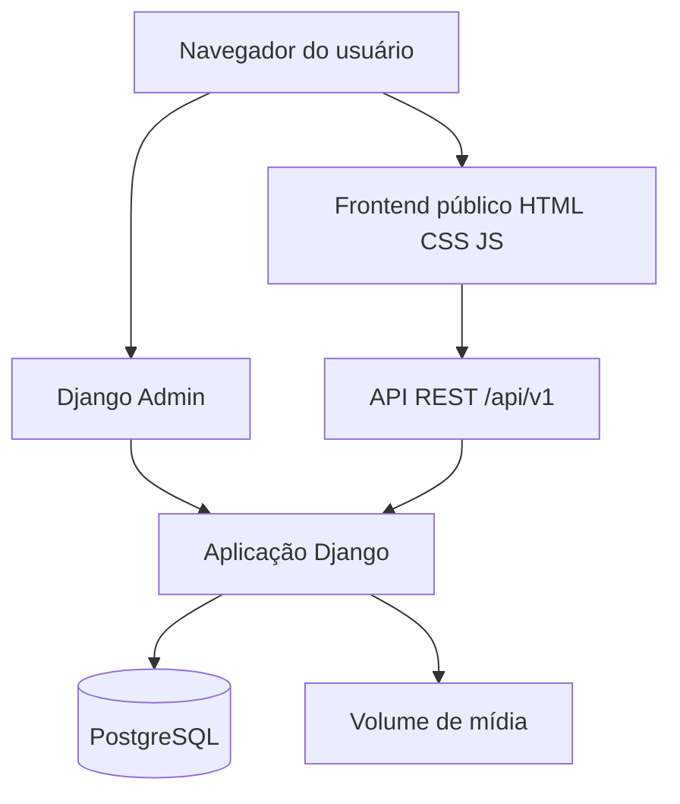

# Diagrama C4 — Containers

```mermaid
flowchart TB
  Browser[Navegador do usuário]
  Frontend[Frontend público HTML CSS JS]
  Admin[Django Admin]
  API[API REST /api/v1]
  Django[Aplicação Django]
  DB[(PostgreSQL)]
  Media[Volume de mídia]

  Browser --> Frontend
  Frontend --> API
  Browser --> Admin
  Admin --> Django
  API --> Django
  Django --> DB
  Django --> Media
```

Containers principais: frontend público, API REST versionada, Django Admin, aplicação Django, PostgreSQL e volume de mídia.
