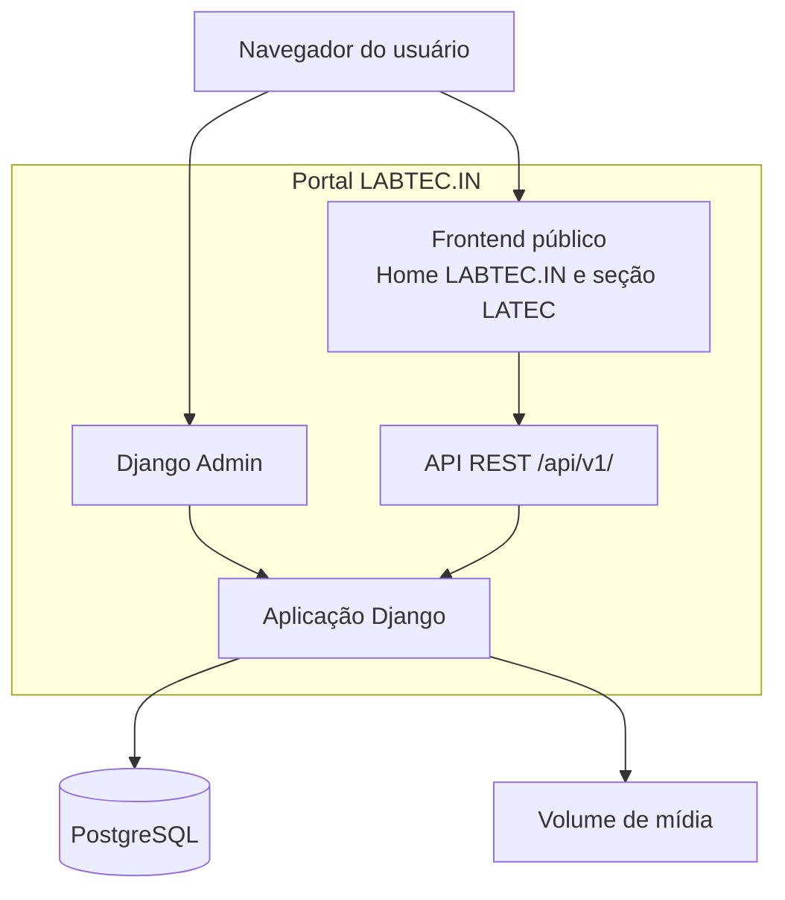

# Diagrama C4 — Containers do portal LABTEC.IN

Os containers técnicos permanecem os mesmos. A seção LATEC é renderizada pelo frontend e filtrada pela unidade `latec` na mesma API e aplicação Django.
