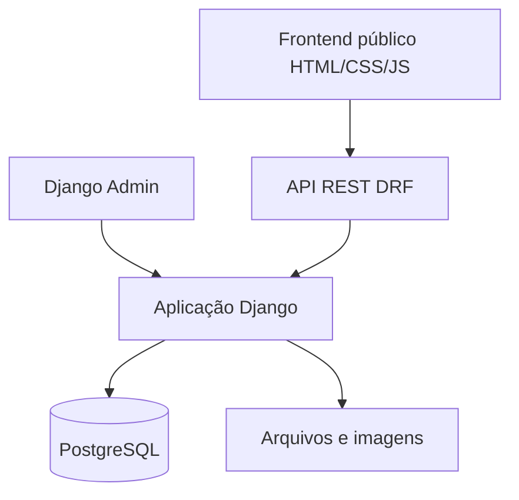

# Diagrama C4 — Containers

```mermaid
flowchart TB
  Frontend[Frontend público HTML/CSS/JS] --> API[API REST DRF]
  Admin[Django Admin] --> Django[Aplicação Django]
  API --> Django
  Django --> DB[(PostgreSQL)]
  Django --> Media[Arquivos e imagens]
```
