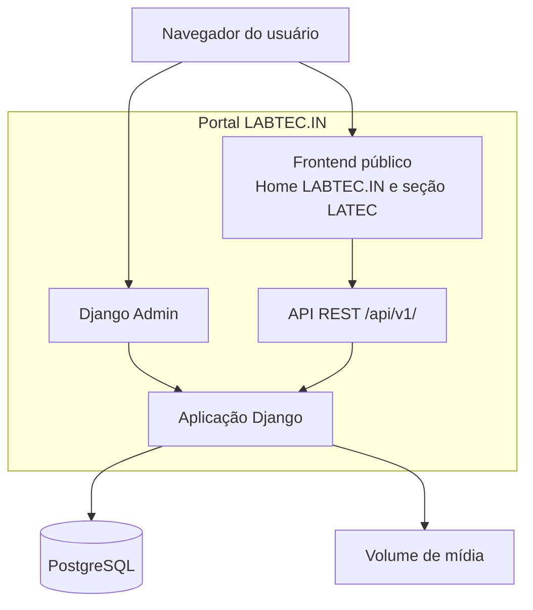

# Diagrama C4 — Containers do portal LABTEC.IN

Os containers técnicos permanecem os mesmos. A seção LATEC usa `?unit=latec` na mesma API; recortes institucionais podem incluir conteúdo de filhas diretas que tenha optado pelo ecossistema da unidade consultada. O volume guarda arquivos referenciados diretamente pelos modelos de domínio, sem catálogo ou container MediaHub.
