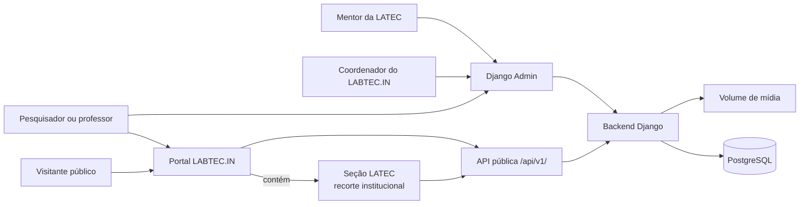

# Diagrama C4 — Contexto do portal LABTEC.IN

O portal pertence ao LABTEC.IN. A LATEC é uma unidade e seção dentro do mesmo sistema, não uma aplicação separada. Visitantes consomem conteúdo público; pesquisadores, professores, mentores e coordenação usam o Django Admin conforme suas permissões institucionais.
