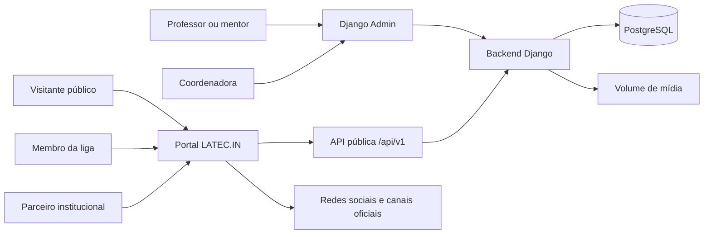

# Diagrama C4 — Contexto

O visitante público consome páginas e dados publicados. Mentores e coordenadora usam o Django Admin. O backend persiste dados em PostgreSQL e gerencia arquivos no volume de mídia.
