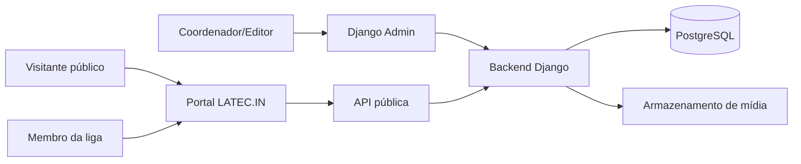

# Diagrama C4 — Contexto

```mermaid
flowchart LR
  Visitor[Visitante público] --> Site[Portal LATEC.IN]
  Member[Membro da liga] --> Site
  Coordinator[Coordenador/Editor] --> Admin[Django Admin]
  Admin --> Backend[Backend Django]
  Site --> API[API pública]
  API --> Backend
  Backend --> DB[(PostgreSQL)]
  Backend --> Media[Armazenamento de mídia]
```
