# ERD conceitual consolidado

```mermaid
erDiagram
  INSTITUTIONAL_UNIT o|--o{ INSTITUTIONAL_UNIT : parent_of
  INSTITUTIONAL_UNIT ||--o{ INSTITUTION_MEMBERSHIP : has
  PERSON ||--o{ INSTITUTION_MEMBERSHIP : participates

  USER ||--o| PROFILE : has
  PERSON ||--o| PROFILE : may_link_to
  INSTITUTIONAL_UNIT o|--o{ PROFILE : may_be_primary_for
  INSTITUTIONAL_UNIT }o--o{ PROFILE : authorizes

  INSTITUTIONAL_UNIT ||--o{ SITE_SETTINGS : configures
  INSTITUTIONAL_UNIT ||--o{ HERO_BANNER : owns
  INSTITUTIONAL_UNIT ||--o{ INSTITUTIONAL_SECTION : owns
  INSTITUTIONAL_UNIT ||--o{ SOCIAL_LINK : owns

  INSTITUTIONAL_UNIT ||--o{ RESEARCH_AXIS : owns
  PERSON ||--o{ AXIS_MENTORSHIP : mentors
  RESEARCH_AXIS ||--o{ AXIS_MENTORSHIP : has

  INSTITUTIONAL_UNIT ||--o{ RESEARCH_PROJECT : owns
  RESEARCH_AXIS o|--o{ RESEARCH_PROJECT : may_classify
  RESEARCH_PROJECT ||--o{ RESEARCH_PROJECT_MEMBER : has
  PERSON ||--o{ RESEARCH_PROJECT_MEMBER : participates

  INSTITUTIONAL_UNIT ||--o{ ACADEMIC_WORK : owns
  RESEARCH_PROJECT o|--o{ ACADEMIC_WORK : may_include
  ACADEMIC_WORK ||--o{ ACADEMIC_WORK_CONTRIBUTOR : has
  PERSON ||--o{ ACADEMIC_WORK_CONTRIBUTOR : contributes

  INSTITUTIONAL_UNIT ||--o{ SCIENTIFIC_OUTPUT : owns
  RESEARCH_AXIS o|--o{ SCIENTIFIC_OUTPUT : may_classify
  RESEARCH_PROJECT o|--o{ SCIENTIFIC_OUTPUT : may_result_in
  ACADEMIC_WORK o|--o{ SCIENTIFIC_OUTPUT : may_result_in
  SCIENTIFIC_OUTPUT ||--o{ SCIENTIFIC_AUTHORSHIP : has
  PERSON ||--o{ SCIENTIFIC_AUTHORSHIP : authors

  INSTITUTIONAL_UNIT ||--o{ PROJECT : owns
  RESEARCH_AXIS o|--o{ PROJECT : may_classify
  PROJECT ||--o{ PROJECT_TEAM_MEMBER : has
  PERSON ||--o{ PROJECT_TEAM_MEMBER : participates
  PROJECT ||--o{ PROJECT_RESULT : produces
  PROJECT ||--o{ PROJECT_LINK : references

  INSTITUTIONAL_UNIT ||--o{ POST : owns
  RESEARCH_AXIS o|--o{ POST : may_classify

  INSTITUTIONAL_UNIT ||--o{ COURSE : owns
  RESEARCH_AXIS o|--o{ COURSE : may_classify
  COURSE ||--o{ COURSE_MATERIAL : provides
  COURSE }o--o{ PERSON : instructed_by

  INSTITUTIONAL_UNIT ||--o{ TRANSPARENCY_DOCUMENT : owns
  INSTITUTIONAL_UNIT }o--o{ PARTNER : relates
  INSTITUTIONAL_UNIT ||--o{ IMPACT_METRIC : measures
  IMPACT_METRIC ||--o{ METRIC_SNAPSHOT : snapshots

  INSTITUTIONAL_UNIT {
    bigint id PK
    string name
    string acronym
    string slug UK
    string unit_type
    bigint parent_id FK
    int display_order
  }

  INSTITUTION_MEMBERSHIP {
    bigint id PK
    bigint person_id FK
    bigint unit_id FK
    string role
    date start_date
    date end_date
    boolean is_active
    boolean is_public
    int display_order
  }

  PERSON {
    bigint id PK
    string full_name
    string slug UK
    boolean is_active
    int display_order
  }

  PROFILE {
    bigint id PK
    bigint user_id FK
    bigint person_id FK
    string role
    bigint primary_unit_id FK
    boolean inherit_descendants
    boolean is_active_admin
  }

  RESEARCH_AXIS {
    bigint id PK
    bigint unit_id FK
    int number
    string title
    string slug UK
    int display_order
  }

  RESEARCH_PROJECT {
    bigint id PK
    bigint unit_id FK
    bigint axis_id FK
    string title
    string slug UK
    string project_status
    string editorial_status
    string file
    string external_url
    boolean include_in_parent_ecosystem
  }

  RESEARCH_PROJECT_MEMBER {
    bigint id PK
    bigint research_project_id FK
    bigint person_id FK
    string role
    int display_order
  }

  ACADEMIC_WORK {
    bigint id PK
    bigint unit_id FK
    bigint research_project_id FK
    string title
    string slug UK
    string work_type
    int year
    string editorial_status
    boolean include_in_parent_ecosystem
  }

  ACADEMIC_WORK_CONTRIBUTOR {
    bigint id PK
    bigint academic_work_id FK
    bigint person_id FK
    string role
    int display_order
  }

  SCIENTIFIC_OUTPUT {
    bigint id PK
    bigint unit_id FK
    bigint research_project_id FK
    bigint academic_work_id FK
    string title
    string slug UK
    string output_type
    string editorial_status
    boolean include_in_parent_ecosystem
  }

  SCIENTIFIC_AUTHORSHIP {
    bigint id PK
    bigint scientific_output_id FK
    bigint person_id FK
    int author_order
    string author_role
  }

  PROJECT {
    bigint id PK
    bigint unit_id FK
    bigint axis_id FK
    string title
    string slug UK
    string editorial_status
    boolean include_in_parent_ecosystem
  }

  POST {
    bigint id PK
    bigint unit_id FK
    bigint axis_id FK
    string title
    string slug UK
    string editorial_status
    boolean include_in_parent_ecosystem
  }

  COURSE {
    bigint id PK
    bigint unit_id FK
    bigint axis_id FK
    string title
    string slug UK
    string editorial_status
    boolean include_in_parent_ecosystem
  }

  TRANSPARENCY_DOCUMENT {
    bigint id PK
    bigint unit_id FK
    string title
    string slug UK
    string editorial_status
    boolean include_in_parent_ecosystem
  }

  PARTNER {
    bigint id PK
    string name
    string slug UK
    int display_order
  }

  IMPACT_METRIC {
    bigint id PK
    bigint unit_id FK
    string key
    int value
    int display_order
  }
```

Todas as relações de propriedade são obrigatórias. Toda `INSTITUTIONAL_UNIT` cadastrada é pública; visibilidade e período permanecem atributos do `INSTITUTION_MEMBERSHIP`. As constraints compostas garantem unicidade de membership, membro de pesquisa, contribuidor e autoria. Models auxiliares sem impacto institucional foram omitidos.
