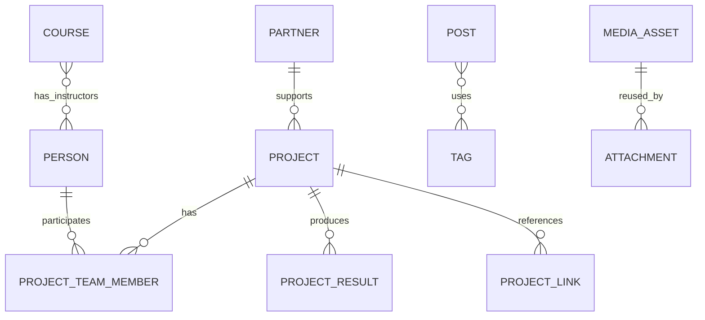

# ERD inicial

```mermaid
erDiagram
  PERSON ||--o{ PROJECT_TEAM_MEMBER : participates
  PROJECT ||--o{ PROJECT_TEAM_MEMBER : has
  PROJECT ||--o{ PROJECT_RESULT : produces
  PROJECT ||--o{ PROJECT_LINK : references
  POST }o--o{ TAG : uses
  COURSE }o--o{ PERSON : has_instructors
  MEDIA_ASSET ||--o{ ATTACHMENT : reused_by
  PARTNER ||--o{ PROJECT : supports
```
