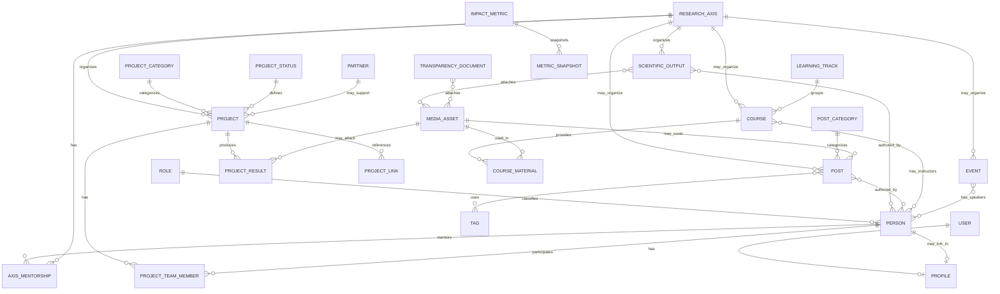

# ERD inicial

```mermaid
erDiagram
  USER ||--o| PROFILE : has
  PERSON ||--o| PROFILE : may_link_to

  ROLE ||--o{ PERSON : classifies
  PERSON ||--o{ AXIS_MENTORSHIP : mentors
  RESEARCH_AXIS ||--o{ AXIS_MENTORSHIP : has

  RESEARCH_AXIS ||--o{ PROJECT : organizes
  RESEARCH_AXIS ||--o{ SCIENTIFIC_OUTPUT : organizes
  RESEARCH_AXIS ||--o{ POST : may_organize
  RESEARCH_AXIS ||--o{ COURSE : may_organize
  RESEARCH_AXIS ||--o{ EVENT : may_organize

  PROJECT_CATEGORY ||--o{ PROJECT : categorizes
  PROJECT_STATUS ||--o{ PROJECT : defines
  PROJECT ||--o{ PROJECT_TEAM_MEMBER : has
  PERSON ||--o{ PROJECT_TEAM_MEMBER : participates
  PROJECT ||--o{ PROJECT_RESULT : produces
  PROJECT ||--o{ PROJECT_LINK : references

  SCIENTIFIC_OUTPUT }o--o{ PERSON : authored_by
  SCIENTIFIC_OUTPUT }o--o{ MEDIA_ASSET : attaches

  POST_CATEGORY ||--o{ POST : categorizes
  POST }o--o{ TAG : uses
  POST }o--o{ PERSON : authored_by

  LEARNING_TRACK ||--o{ COURSE : groups
  COURSE }o--o{ PERSON : has_instructors
  COURSE ||--o{ COURSE_MATERIAL : provides
  EVENT }o--o{ PERSON : has_speakers

  TRANSPARENCY_DOCUMENT }o--o{ MEDIA_ASSET : attaches

  MEDIA_ASSET ||--o{ COURSE_MATERIAL : used_in
  MEDIA_ASSET ||--o{ PROJECT_RESULT : may_attach
  MEDIA_ASSET ||--o{ POST : may_cover

  PARTNER ||--o{ PROJECT : may_support
  IMPACT_METRIC ||--o{ METRIC_SNAPSHOT : snapshots
```

Este diagrama representa a modelagem conceitual inicial. A implementação Django pode ajustar nomes, tabelas intermediárias e cardinalidades conforme necessidade.
