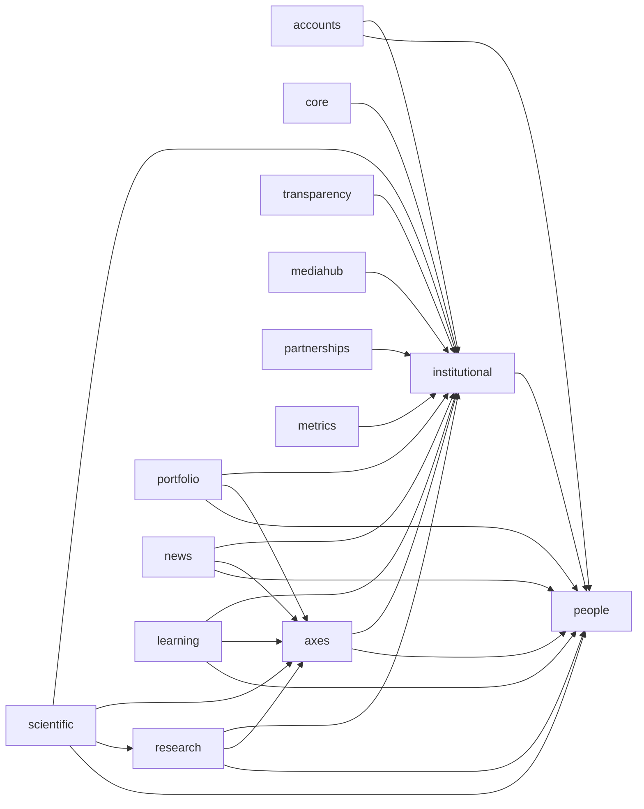

# Mapa de relações de modelo implementadas

Cada seta parte do app que mantém a FK ou M2M e aponta para o app cujo modelo é referenciado. O autorrelacionamento de `InstitutionalUnit` e as relações internas de cada app foram omitidos para manter o mapa legível.

`common` fornece classes-base, workflow, viewsets e o mixin administrativo, mas não mantém relações de banco. `MediaAsset` e `ImpactMetric` possuem unidade própria; ainda não existem relações automáticas dos demais domínios com esses registros. A conversão histórica entre `portfolio` e `research` usa apenas um identificador técnico de proveniência, não uma FK pública.
