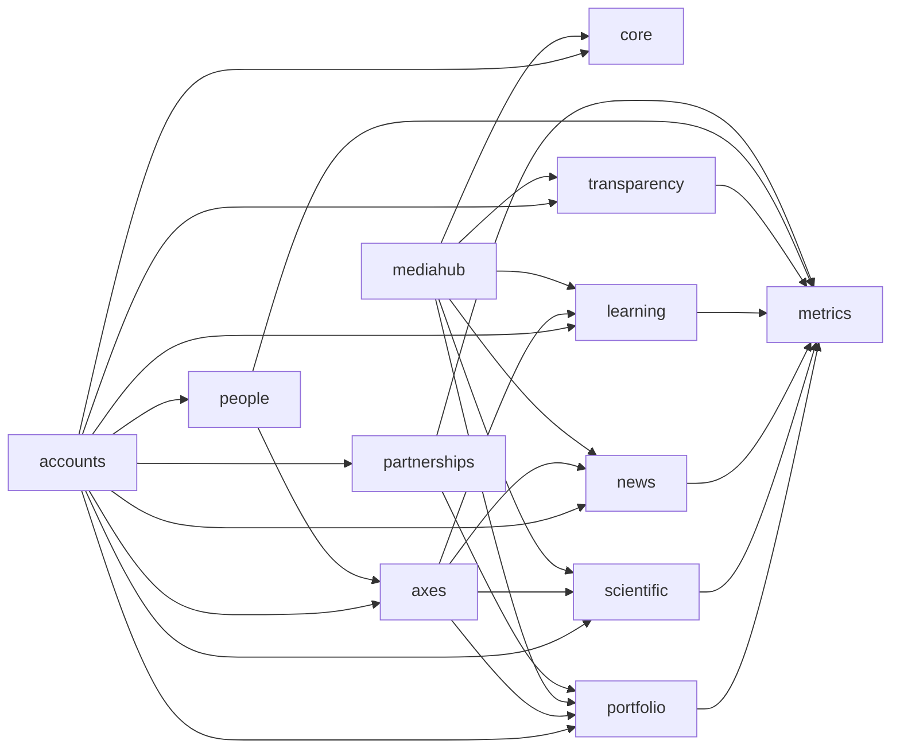

# Mapa de módulos

```mermaid
flowchart LR
  accounts --> core
  accounts --> people
  accounts --> axes
  accounts --> portfolio
  accounts --> scientific
  accounts --> news
  accounts --> learning
  accounts --> transparency
  accounts --> partnerships

  people --> axes
  axes --> portfolio
  axes --> scientific
  axes --> news
  axes --> learning

  mediahub --> core
  mediahub --> portfolio
  mediahub --> scientific
  mediahub --> news
  mediahub --> learning
  mediahub --> transparency

  partnerships --> portfolio

  portfolio --> metrics
  scientific --> metrics
  news --> metrics
  learning --> metrics
  transparency --> metrics
  people --> metrics
  partnerships --> metrics
```

`axes` passa a ser módulo central de organização institucional. `mediahub` centraliza arquivos. `metrics` agrega dados públicos dos demais apps para a Home.
