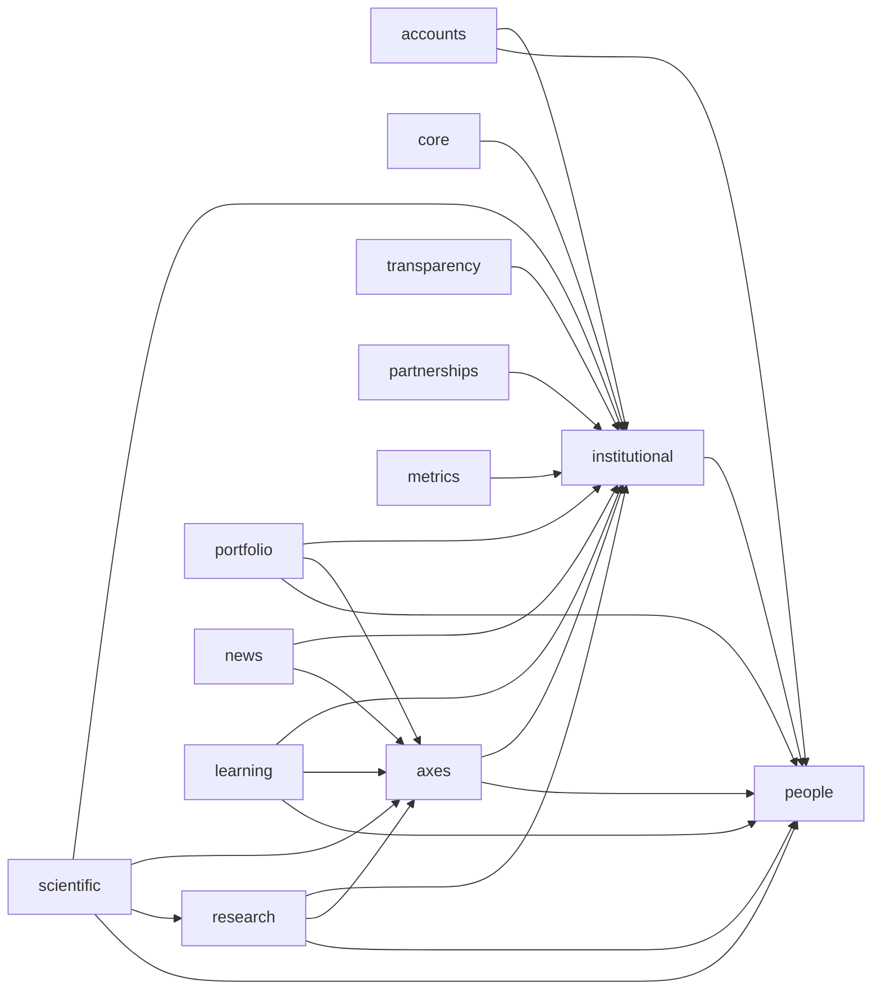

# Mapa de relações de modelo consolidadas

Cada seta parte do app que mantém a FK ou M2M e aponta para o app referenciado. Relações internas e o autorrelacionamento de `InstitutionalUnit` foram omitidos.

`common` fornece `BaseModel`, workflow, viewsets e escopo administrativo sem relações próprias de banco. Arquivos pertencem aos apps de domínio; não existe app central de mídia no grafo ou em `INSTALLED_APPS`.
