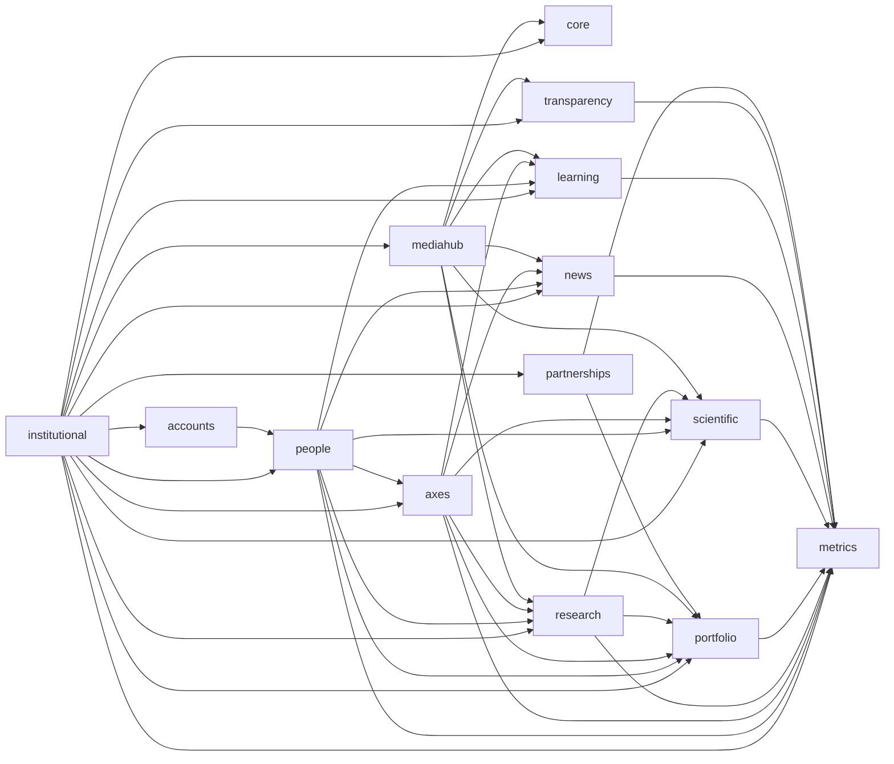

# Mapa de módulos alvo

As setas indicam conceitos fornecidos ou relações consumidas pelo módulo de destino. `institutional` é a raiz organizacional; `axes` organiza a LATEC; `research` separa pesquisa e trabalhos acadêmicos; `metrics` consolida indicadores por unidade.
